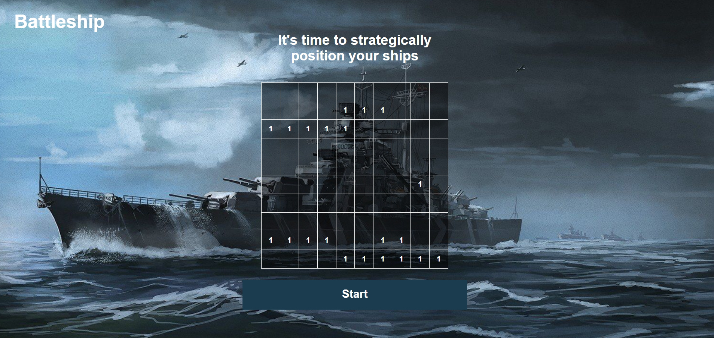

## Project Description

> **Battleship(game)** is a strategy type *guessing game* for two players(you and bot). It is played on ruled grids on which each player's fleet of warships are marked. The locations of the fleets are concealed from the other player. Players alternate turns calling "shots" at the other player's ships, and the objective of the game is to destroy the opposing player's fleet.

## Built With

- Vanilla JavaScript

## Snippets

